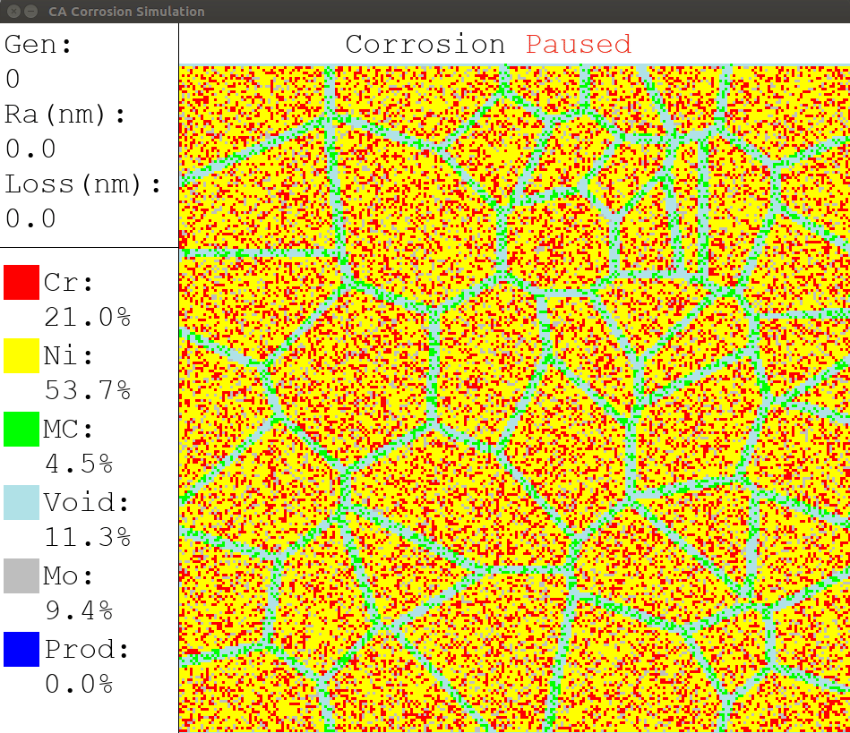

## 1. General description
This is a cellular automata program to simulate the diffusion of corrosive agents and the reaction between materials and agents. Thickness, roughness, and contents are computed during the simulation. Users can specify the problem via input cards. A GUI is used to display the simulation results in real time.  Keyboard interactions with the program is provided as well.

 

## 2. File organization
```
cellular-automata-corrosion
├── input
│   ├── 136.int
│   ├── 17.int
│   ├── 37.int
│   ├── 44.int
│   ├── 77.int
│   ├── diffusion.txt
│   ├── materials.txt
│   ├── rules.txt
│   └── termination.txt
├── output
│   └── plots
│       ├── contents.py
│       ├── ratio.py
│       ├── roughness.py
│       ├── set_mpl.py
│       └── thickness.py
├── README.md
├── requirements.txt
└── src
    ├── configs
    │   └── configs.py
    ├── inits.py
    ├── main.py
    ├── utils.py
    └── voronoi.py
```

## 3. How to run program
### Input cards 
- Modify `diffusion.txt`, `materials.txt`, `rules.txt`, `termination.txt` to define the simulation problem
- Create `<filename>.int` to initialize the board
- Place all text files above in `input/`

### Run program 
- Go to directory `src/`
- Run  `python3 main.py ../input/<filename>.int` 

## Output
- After finishing the simulation, three files should be found in folder `output/`
    - `<filename>_roughness.txt`
    - `<filename>_content.txt`
    - `<filename>_thickness.txt`
- Optionally, go to director `output/plots/` and run the following code to get corresponding plots
    - `python3 contents.py`
    - `python3 ratio.py` 
    - `python3 roughness.py` 
    - `python3 thickness.py`
